# Design Document

## Overview

POS Xpress is a comprehensive backend system providing REST API services for mobile Point of Sale applications with offline-first capabilities and a Filament-based admin panel. The system supports multi-tier subscriptions, multi-outlet management, inventory tracking with COGS calculation, and comprehensive reporting.

## Architecture

### High-Level System Architecture


## Components and Interfaces

### Technology Stack

| Component | Technology | Version | Purpose |
|-----------|------------|---------|---------|
| **Runtime** | PHP | 8.4+ | Application runtime |
| **Framework** | Laravel | 12.x | Web application framework |
| **Authentication** | Laravel Sanctum | Latest | API token management |
| **Authorization** | Spatie Laravel Permission | Latest | Role-based access control |
| **Admin Panel** | FilamentPHP | Latest | Administrative interface |
| **Database** | MySQL | Latest | Primary data storage |
| **Cache/Queue** | Redis | Latest | Caching and job queues |
| **Web Server** | Nginx | Latest | HTTP server and reverse proxy |
| **Process Manager** | Supervisor | Latest | Queue worker management |
| **Testing** | PHPUnit/Pest | Latest | Unit and feature testing |
| **Code Quality** | Laravel Pint | Latest | Code formatting and linting |
| **Monitoring** | Telescope/Sentry | Latest| Application monitoring |

### API Interface Design

#### Authentication Endpoints
```php
POST /api/v1/auth/login
POST /api/v1/auth/logout
POST /api/v1/auth/refresh
GET  /api/v1/auth/user
```

#### Core Business Endpoints
```php
// Product Catalog
GET    /api/v1/categories
POST   /api/v1/categories
GET    /api/v1/products
POST   /api/v1/products
PUT    /api/v1/products/{id}

// Point of Sale
POST   /api/v1/orders
GET    /api/v1/orders/{id}
PUT    /api/v1/orders/{id}/complete
POST   /api/v1/orders/{id}/payments
POST   /api/v1/orders/{id}/refunds

// Inventory (Pro/Enterprise only)
GET    /api/v1/inventory/stock
POST   /api/v1/inventory/adjustments
GET    /api/v1/inventory/movements

// Reports
GET    /api/v1/reports/sales
GET    /api/v1/reports/inventory
GET    /api/v1/reports/cashflow

// Sync (Mobile offline support)
POST   /api/v1/sync/orders
POST   /api/v1/sync/inventory
GET    /api/v1/sync/status
```

#### Response Format Standards
```json
{
  "success": true,
  "data": {},
  "message": "Operation completed successfully",
  "meta": {
    "timestamp": "2024-01-01T00:00:00Z",
    "version": "v1",
    "request_id": "uuid"
  }
}
```

### Project Structure

```
app/
├── Console/
│   ├── Commands/           # Custom artisan commands
│   └── Kernel.php         # Command scheduling
├── Filament/
│   ├── Resources/         # Filament CRUD resources
│   ├── Widgets/           # Dashboard widgets
│   ├── Pages/             # Custom admin pages
│   └── Clusters/          # Resource grouping
├── Http/
│   ├── Controllers/
│   │   └── Api/V1/        # Versioned API controllers
│   ├── Middleware/
│   │   ├── PlanGateMiddleware.php
│   │   ├── TenantScopeMiddleware.php
│   │   └── ApiVersionMiddleware.php
│   ├── Requests/          # Form request validation
│   └── Resources/         # API resource transformers
├── Models/
│   ├── Concerns/          # Model traits
│   ├── Scopes/            # Global query scopes
│   └── [Business Models]  # Core business entities
├── Services/
│   ├── Auth/              # Authentication services
│   ├── Pos/               # Point of sale logic
│   ├── Inventory/         # Stock management
│   ├── Subscription/      # Plan management
│   ├── Reporting/         # Report generation
│   └── Sync/              # Offline synchronization
├── Repositories/
│   ├── Contracts/         # Repository interfaces
│   └── Eloquent/          # Eloquent implementations
├── Jobs/                  # Queue job classes
├── Events/                # Domain events
├── Listeners/             # Event handlers
├── Policies/              # Authorization policies
├── Providers/             # Service providers
└── Exceptions/            # Custom exceptions

database/
├── migrations/            # Database schema
├── seeders/              # Data seeders
└── factories/            # Model factories

tests/
├── Feature/              # Integration tests
├── Unit/                 # Unit tests
└── Pest.php             # Pest configuration

config/
├── filament.php          # Filament configuration
├── permission.php        # Spatie permissions
└── subscription.php      # Custom subscription config
```

## Data Models

### Entity Relationship Diagram


### Key Model Relationships

#### Multi-Tenancy Implementation
- All models include `store_id` for data isolation
- Global scopes automatically filter by current store
- Policies prevent cross-store data access

#### Subscription & Plan Gating
- Store has one active Subscription
- Subscription belongs to a Plan with defined limits
- Middleware enforces plan restrictions on operations

#### Inventory Tracking
- Products can have `track_inventory` flag
- InventoryMovement records all stock changes
- COGS calculated from Recipe or weighted average

## Error Handling

### Error Response Strategy

```php
// Standard error response format
{
    "success": false,
    "error": {
        "code": "VALIDATION_ERROR",
        "message": "The given data was invalid.",
        "details": {
            "email": ["The email field is required."]
        }
    },
    "meta": {
        "timestamp": "2024-01-01T00:00:00Z",
        "request_id": "uuid"
    }
}
```

### Error Categories

| Error Type | HTTP Status | Code | Description |
|------------|-------------|------|-------------|
| Validation | 422 | VALIDATION_ERROR | Input validation failed |
| Authentication | 401 | UNAUTHENTICATED | Invalid or missing token |
| Authorization | 403 | UNAUTHORIZED | Insufficient permissions |
| Plan Limit | 403 | PLAN_LIMIT_EXCEEDED | Subscription limit reached |
| Not Found | 404 | RESOURCE_NOT_FOUND | Resource doesn't exist |
| Rate Limit | 429 | RATE_LIMIT_EXCEEDED | Too many requests |
| Server Error | 500 | INTERNAL_ERROR | Unexpected server error |

### Exception Handling Flow

```mermaid
graph TD
    A[Request] --> B[Middleware Stack]
    B --> C[Controller Action]
    C --> D{Exception Thrown?}
    D -->|Yes| E[Exception Handler]
    D -->|No| F[Success Response]
    E --> G{Exception Type}
    G -->|Validation| H[422 Response]
    G -->|Auth| I[401 Response]
    G -->|Authorization| J[403 Response]
    G -->|Not Found| K[404 Response]
    G -->|Server Error| L[500 Response + Log]
    H --> M[Return to Client]
    I --> M
    J --> M
    K --> M
    L --> M
    F --> M
```



## Testing Strategy

### Test Coverage Requirements

| Test Type | Coverage Target | Purpose |
|-----------|----------------|---------|
| Unit Tests | 90%+ | Business logic, calculations, utilities |
| Feature Tests | 80%+ | API endpoints, workflows |
| Integration Tests | 70%+ | External service interactions |
| E2E Tests | Key flows | Complete user journeys |

### Test Structure

```php
// Unit Test Example
class PlanGateMiddlewareTest extends TestCase
{
    public function test_basic_plan_blocks_inventory_features()
    {
        // Arrange: User with Basic plan
        // Act: Access inventory endpoint
        // Assert: 403 response with plan limit error
    }
}

// Feature Test Example  
class OrderApiTest extends TestCase
{
    public function test_can_create_order_with_valid_data()
    {
        // Arrange: Authenticated user, valid products
        // Act: POST /api/v1/orders
        // Assert: 201 response, order created in database
    }
}
```

### Performance Testing

- Load testing with 100 concurrent users per store
- Stress testing POS endpoints under peak load
- Database query optimization validation
- Memory usage profiling for large datasets

## Security Implementation

### Authentication Flow


### Authorization Layers

1. **Authentication**: Sanctum bearer token validation
2. **Multi-tenancy**: Store-scoped data access
3. **RBAC**: Spatie permission checking with multi-level admin access
4. **Plan Gating**: Subscription feature/limit validation
5. **Rate Limiting**: Request throttling per user/IP

### Multi-Level Admin Access System

#### Role Hierarchy


#### Default Roles & Permissions

| Role | Scope | Key Permissions | Access Level |
|------|-------|----------------|--------------|
| **admin_sistem** | Global | `*` (all permissions) | System-wide, bypasses tenant scoping |
| **owner** | Store-scoped | `users.manage`, `roles.manage`, `subscription.view` | Full store access |
| **manager** | Store-scoped | `reports.view`, `inventory.manage`, `products.manage` | Operational management |
| **cashier** | Store-scoped | `orders.create`, `orders.view`, `payments.process` | POS operations only |

#### Granular Permissions Matrix

```php
// Permission categories and specific permissions
$permissions = [
    'users' => ['view', 'create', 'update', 'delete', 'manage_roles'],
    'products' => ['view', 'create', 'update', 'delete', 'manage_categories'],
    'orders' => ['view', 'create', 'update', 'delete', 'refund', 'void'],
    'inventory' => ['view', 'adjust', 'transfer', 'reports'],
    'reports' => ['view', 'export', 'email'],
    'cash_sessions' => ['open', 'close', 'view', 'manage'],
    'subscription' => ['view', 'manage'], // admin_sistem only
    'system' => ['backup', 'maintenance', 'logs'], // admin_sistem only
];
```

#### Multi-Tenancy Enforcement

```php
// Global scope for automatic store filtering
class StoreScope implements Scope
{
    public function apply(Builder $builder, Model $model)
    {
        $user = auth()->user();
        
        // System admin bypasses tenant scoping
        if ($user && $user->hasRole('admin_sistem')) {
            return;
        }
        
        // Apply store scoping for all other users
        if ($user && $user->store_id) {
            $builder->where('store_id', $user->store_id);
        }
    }
}

// Middleware for additional tenant validation
class TenantScopeMiddleware
{
    public function handle($request, Closure $next)
    {
        $user = auth()->user();
        
        // Skip for system admin
        if ($user->hasRole('admin_sistem')) {
            return $next($request);
        }
        
        // Validate store access for route parameters
        if ($request->route('store') && $request->route('store') !== $user->store_id) {
            abort(403, 'Access denied to this store');
        }
        
        return $next($request);
    }
}
```

#### Filament Admin Panel Configuration

```php
// Different panels for different user types
class SystemAdminPanelProvider extends PanelProvider
{
    public function panel(Panel $panel): Panel
    {
        return $panel
            ->id('system-admin')
            ->path('/system-admin')
            ->authGuard('web')
            ->authMiddleware(['auth', 'role:admin_sistem'])
            ->resources([
                StoreResource::class,
                SubscriptionResource::class,
                GlobalUserResource::class,
                SystemMetricsResource::class,
            ]);
    }
}

class StoreOwnerPanelProvider extends PanelProvider
{
    public function panel(Panel $panel): Panel
    {
        return $panel
            ->id('store-admin')
            ->path('/admin')
            ->authGuard('web')
            ->authMiddleware(['auth', 'tenant.scope'])
            ->resources([
                UserResource::class,
                ProductResource::class,
                OrderResource::class,
                ReportResource::class,
            ]);
    }
}
```

#### Owner Staff Management API

```php
// API endpoints for store owners to manage staff
Route::middleware(['auth:sanctum', 'role:owner'])->group(function () {
    Route::apiResource('staff', StaffController::class);
    Route::post('staff/{user}/roles', [StaffController::class, 'assignRole']);
    Route::delete('staff/{user}/roles/{role}', [StaffController::class, 'removeRole']);
    Route::post('staff/{user}/permissions', [StaffController::class, 'grantPermission']);
    Route::delete('staff/{user}/permissions/{permission}', [StaffController::class, 'revokePermission']);
});

class StaffController extends Controller
{
    public function assignRole(User $user, Request $request)
    {
        // Validate user belongs to same store
        if ($user->store_id !== auth()->user()->store_id) {
            abort(403, 'Cannot manage staff from different store');
        }
        
        // Validate role is not system admin
        $role = $request->input('role');
        if ($role === 'admin_sistem') {
            abort(403, 'Cannot assign system admin role');
        }
        
        $user->assignRole($role);
        
        return response()->json(['message' => 'Role assigned successfully']);
    }
}
```

### Subscription Plan Limits

| Feature | Basic Plan | Pro Plan | Enterprise Plan |
|---------|------------|----------|-----------------|
| Products | 20 | 300 | Unlimited |
| Annual Transactions | 12,000 (soft cap) | 120,000 (soft cap) | Unlimited |
| Customers/Members | Unlimited | Unlimited | Unlimited |
| Staff Users | 2 | 10 | Unlimited |
| Outlets | 1 | 1 | Unlimited |
| Inventory Tracking | ❌ | ✅ | ✅ |
| COGS Calculation | ❌ | ✅ | ✅ |
| Advanced Reports | ❌ | ✅ | ✅ |
| Monthly Email Reports | ❌ | ✅ | ✅ |
| Report Export (over quota) | ❌ | Limited | ✅ |
| API Rate Limit | 60/min | 120/min | 300/min |

```php
// Plan Gate Middleware Implementation with Soft Cap Logic
class PlanGateMiddleware
{
    public function handle($request, Closure $next, $feature, $limit = null)
    {
        $store = auth()->user()->store;
        $subscription = $store->activeSubscription;
        
        // Check feature access
        if (!$subscription->plan->hasFeature($feature)) {
            return response()->json([
                'error' => 'PLAN_FEATURE_REQUIRED',
                'message' => "This feature requires {$subscription->plan->getRequiredPlanFor($feature)} plan or higher"
            ], 403);
        }
        
        // Check hard limits (products, users)
        if ($limit && $store->hasExceededHardLimit($feature, $limit)) {
            return response()->json([
                'error' => 'PLAN_LIMIT_EXCEEDED',
                'message' => "You have reached the {$feature} limit for your plan",
                'current_usage' => $store->getCurrentUsage($feature),
                'plan_limit' => $subscription->plan->getLimit($feature)
            ], 403);
        }
        
        // Check transaction soft cap
        if ($feature === 'transactions' && $store->hasExceededTransactionQuota()) {
            // Continue processing but add warning headers
            $response = $next($request);
            $response->headers->set('X-Quota-Warning', 'Annual transaction quota exceeded');
            $response->headers->set('X-Upgrade-Recommended', 'true');
            
            // Trigger soft cap notification (async)
            dispatch(new SendQuotaWarningNotification($store));
            
            return $response;
        }
        
        // Check premium feature access when over quota
        if ($store->hasExceededTransactionQuota() && in_array($feature, ['report_export', 'advanced_analytics'])) {
            return response()->json([
                'error' => 'QUOTA_EXCEEDED_PREMIUM_BLOCKED',
                'message' => 'Premium features are limited when transaction quota is exceeded. Please upgrade your plan.',
                'upgrade_url' => route('subscription.upgrade')
            ], 403);
        }
        
        return $next($request);
    }
}
```

### Data Protection

- Sensitive data encrypted at rest (Laravel encryption)
- HTTPS enforced for all API communications
- SQL injection prevention via Eloquent ORM
- XSS protection through input sanitization
- CSRF protection for web routes

## Deployment Architecture

### Environment Configuration

```yaml
# docker-compose.yml structure for multiple environments
version: '3.8'
services:
  app:
    image: php:8.3-fpm
    volumes:
      - ./:/var/www/html
    environment:
      - APP_ENV=${APP_ENV:-production}
      - APP_DEBUG=${APP_DEBUG:-false}
    depends_on:
      - mysql
      - redis
      
  nginx:
    image: nginx:alpine
    ports:
      - "80:80"
      - "443:443"
    volumes:
      - ./docker/nginx:/etc/nginx/conf.d
      
  mysql:
    image: mysql:8.0
    environment:
      - MYSQL_DATABASE=pos_xpress
      - MYSQL_ROOT_PASSWORD=${DB_PASSWORD}
    volumes:
      - mysql_data:/var/lib/mysql
      
  redis:
    image: redis:7-alpine
    volumes:
      - redis_data:/data
    
  supervisor:
    image: php:8.3-cli
    command: supervisord -c /etc/supervisor/conf.d/supervisord.conf
    volumes:
      - ./:/var/www/html
    depends_on:
      - mysql
      - redis

# Environment-specific overrides
# docker-compose.staging.yml
services:
  app:
    environment:
      - APP_ENV=staging
      - APP_DEBUG=true
      - LOG_LEVEL=debug

# docker-compose.local.yml  
services:
  app:
    environment:
      - APP_ENV=local
      - APP_DEBUG=true
    ports:
      - "8000:8000"
```

### CI/CD Pipeline


#### Environment Strategy
- **Local**: Development with hot reload and debug tools
- **Staging**: Production-like environment for integration testing
- **Production**: Live environment with monitoring and alerting

### Monitoring & Observability

#### Health Check Endpoint
```php
GET /api/v1/health
{
    "status": "healthy",
    "services": {
        "database": "connected",
        "redis": "connected",
        "queue": "processing"
    },
    "metrics": {
        "response_time": "45ms",
        "memory_usage": "128MB",
        "active_connections": 23
    }
}
```

#### Offline Sync Conflict Resolution

```php
// Sync conflict resolution strategies with idempotency
class SyncConflictResolver
{
    public function resolveOrderConflict($localOrder, $serverOrder)
    {
        // Validate idempotency key first
        if ($this->isDuplicateRequest($localOrder->idempotency_key)) {
            return $this->getExistingResponse($localOrder->idempotency_key);
        }
        
        // Strategy 1: Last-write wins (default)
        if ($localOrder->updated_at > $serverOrder->updated_at) {
            return $this->applyLocalChanges($localOrder, $serverOrder);
        }
        
        // Strategy 2: Merge non-conflicting fields
        return $this->mergeOrders($localOrder, $serverOrder);
    }
    
    public function resolveInventoryConflict($localMovement, $serverStock)
    {
        // Check idempotency for inventory movements
        if ($this->isMovementProcessed($localMovement->idempotency_key)) {
            return $this->getMovementResponse($localMovement->idempotency_key);
        }
        
        // Always apply movements, adjust final stock
        $this->applyMovement($localMovement);
        $this->reconcileStock($serverStock);
    }
    
    private function isDuplicateRequest($idempotencyKey)
    {
        return SyncHistory::where('idempotency_key', $idempotencyKey)->exists();
    }
}
```

#### Activity & Audit Logging Strategy

```php
// Activity logging for compliance and debugging
class ActivityLogger
{
    protected $auditableEvents = [
        'order.created', 'order.completed', 'order.refunded',
        'product.created', 'product.updated', 'product.deleted',
        'inventory.adjusted', 'cash_session.opened', 'cash_session.closed',
        'user.login', 'user.logout', 'permission.granted'
    ];
    
    public function log($event, $model, $changes = [])
    {
        ActivityLog::create([
            'store_id' => auth()->user()->store_id,
            'user_id' => auth()->id(),
            'event' => $event,
            'auditable_type' => get_class($model),
            'auditable_id' => $model->id,
            'old_values' => $changes['old'] ?? null,
            'new_values' => $changes['new'] ?? null,
            'ip_address' => request()->ip(),
            'user_agent' => request()->userAgent(),
            'created_at' => now()
        ]);
    }
}
```

#### Logging Strategy
- **Structured JSON logging** with correlation IDs for request tracing
- **Error tracking** via Sentry for production issues and alerts
- **Performance monitoring** via Telescope for development and debugging
- **Business metrics** via custom dashboard for operational insights
- **Activity logging** for all user actions with 90-day retention
- **Audit export** capability for compliance requirements

#### API Versioning Policy

```php
// Version management strategy
Route::prefix('api/v1')->group(function () {
    // Current stable API
    Route::apiResource('orders', OrderController::class);
});

Route::prefix('api/v2')->group(function () {
    // New version with breaking changes
    Route::apiResource('orders', V2\OrderController::class);
});

// Deprecation headers for v1 when v2 is available
class ApiVersionMiddleware
{
    public function handle($request, Closure $next)
    {
        $response = $next($request);
        
        if ($request->is('api/v1/*')) {
            $response->headers->set('X-API-Deprecation-Warning', 'API v1 will be deprecated on 2024-12-31');
            $response->headers->set('X-API-Sunset', '2024-12-31');
            $response->headers->set('X-API-Migration-Guide', 'https://docs.posxpress.com/api/v2-migration');
        }
        
        return $response;
    }
}
```

#### Backup & Recovery
- **Database**: Daily automated backups with 30-day retention
- **Files**: Weekly backup to cloud storage (S3/equivalent) with 90-day retention
- **Receipts**: 30-day local storage, then archived to cloud for 1 year
- **Activity Logs**: 90-day retention for compliance
- **Recovery Testing**: Quarterly disaster recovery drills with documented procedures
- **Point-in-time Recovery**: Available for last 7 days with hourly granularity
- **Backup Verification**: Automated integrity checks on all backup files

#### Operational Guidelines

```yaml
# Retention Policies
data_retention:
  activity_logs: 90_days
  receipts_local: 30_days
  receipts_archive: 1_year
  database_backups: 30_days
  file_backups: 90_days
  error_logs: 60_days

# Recovery Procedures
recovery_testing:
  frequency: quarterly
  scenarios:
    - complete_database_restore
    - partial_data_recovery
    - file_system_restore
  documentation: required
  success_criteria: rto_4_hours_rpo_1_hour

# Monitoring Thresholds
alerts:
  api_response_time: 500ms
  error_rate: 1%
  queue_backlog: 1000_jobs
  disk_usage: 80%
  memory_usage: 85%
```

