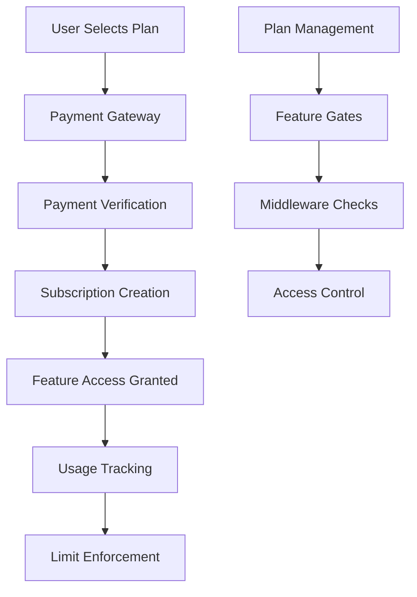
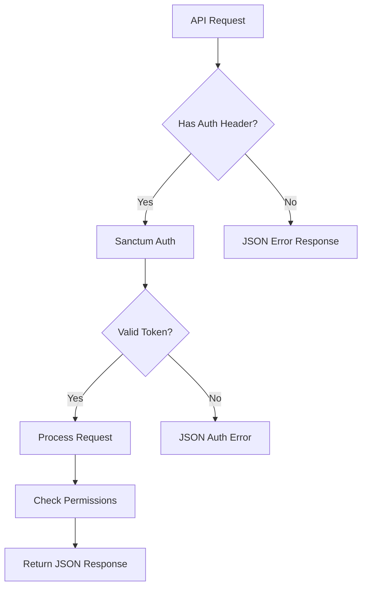

# Design Document

## Overview

This design addresses the completion of the subscription payment flow and fixes API authentication issues. The system will provide a complete subscription management system with proper payment processing, plan enforcement, and consistent JSON API responses.

## Architecture

### Subscription Payment Flow Architecture



### API Authentication Flow



## Components and Interfaces

### 1. Payment Integration Component

**PaymentService**
- Integrates with payment gateways (Stripe, PayPal, etc.)
- Handles payment processing and verification
- Manages payment methods and billing
- Processes refunds and chargebacks

**PaymentController**
- Handles payment initiation
- Processes payment callbacks/webhooks
- Manages payment method CRUD operations

### 2. Subscription Management Component

**Enhanced SubscriptionService** (extends existing)
- Adds payment processing integration
- Handles subscription lifecycle events
- Manages plan changes with payment adjustments
- Processes subscription renewals and cancellations

**SubscriptionController**
- Provides subscription CRUD API endpoints
- Handles plan selection and changes
- Manages subscription status and billing

### 3. Plan Management Component

**PlanService**
- Manages subscription plans and pricing
- Handles plan activation/deactivation
- Calculates pricing for different billing cycles

**PlanController**
- Provides plan management API endpoints
- Handles plan CRUD operations
- Returns available plans for subscription

### 4. Feature Gate Component

**Enhanced PlanGateMiddleware** (extends existing)
- Checks subscription status and plan features
- Enforces usage limits
- Provides upgrade recommendations

**FeatureGateService**
- Centralizes feature access logic
- Tracks feature usage
- Manages feature availability per plan

### 5. API Response Component

**ApiResponseMiddleware**
- Ensures consistent JSON responses for API routes
- Handles authentication failures with JSON errors
- Manages CORS and API headers

**ApiExceptionHandler**
- Converts exceptions to JSON responses
- Provides consistent error formatting
- Handles validation errors appropriately

## Data Models

### Enhanced Models

**Plan Model** (already exists, minor enhancements)
- Add payment gateway integration fields
- Add trial period configuration
- Add setup fees and discounts

**Subscription Model** (already exists, minor enhancements)
- Add payment method reference
- Add billing address information
- Add subscription events tracking

**New Models:**

**PaymentMethod Model**
```php
- id (uuid)
- user_id (foreign key)
- gateway (stripe, paypal, etc.)
- gateway_id (external payment method ID)
- type (card, bank_account, etc.)
- last_four (for display)
- expires_at (for cards)
- is_default (boolean)
- metadata (json)
```

**Invoice Model**
```php
- id (uuid)
- subscription_id (foreign key)
- amount (decimal)
- tax_amount (decimal)
- status (pending, paid, failed, refunded)
- due_date (date)
- paid_at (timestamp)
- invoice_number (string)
- line_items (json)
- metadata (json)
```

**Payment Model** (enhance existing)
```php
- Add gateway_transaction_id
- Add payment_method_id reference
- Add invoice_id reference
- Add gateway_fee amount
```

## Error Handling

### API Error Response Format

```json
{
  "success": false,
  "error": {
    "code": "AUTHENTICATION_FAILED",
    "message": "Invalid or expired token",
    "details": {
      "field": "authorization",
      "reason": "token_expired"
    }
  },
  "meta": {
    "timestamp": "2025-09-29T10:00:00Z",
    "version": "v1",
    "request_id": "req_123456"
  }
}
```

### Payment Error Handling

- Gateway communication failures
- Payment method validation errors
- Insufficient funds handling
- Subscription limit violations
- Plan change constraint violations

### Authentication Error Handling

- Invalid token responses
- Expired token handling
- Missing authorization headers
- Role/permission violations
- Rate limiting responses

## Testing Strategy

### Unit Tests

1. **PaymentService Tests**
   - Payment processing logic
   - Gateway integration mocking
   - Error handling scenarios

2. **SubscriptionService Tests**
   - Subscription lifecycle management
   - Plan change calculations
   - Usage tracking accuracy

3. **Middleware Tests**
   - API response formatting
   - Authentication flow
   - Feature gate enforcement

### Integration Tests

1. **Payment Flow Tests**
   - End-to-end payment processing
   - Webhook handling
   - Subscription activation

2. **API Authentication Tests**
   - Token validation
   - Permission checking
   - Error response formatting

3. **Subscription Management Tests**
   - Plan upgrades/downgrades
   - Usage limit enforcement
   - Billing cycle processing

### API Tests

1. **Postman Collection**
   - All subscription endpoints
   - Payment processing flows
   - Error scenario testing
   - Authentication testing

2. **Feature Tests**
   - Complete subscription flow
   - Plan management operations
   - Usage tracking validation

## Security Considerations

### Payment Security

- PCI DSS compliance for payment data
- Secure token handling for payment methods
- Webhook signature verification
- Payment fraud detection

### API Security

- Rate limiting on authentication endpoints
- Token expiration and rotation
- Request signing for sensitive operations
- Input validation and sanitization

### Subscription Security

- Plan limit enforcement
- Usage tracking integrity
- Subscription tampering prevention
- Billing data protection

## Performance Considerations

### Payment Processing

- Asynchronous webhook processing
- Payment retry mechanisms
- Gateway failover strategies
- Transaction logging and monitoring

### API Performance

- Response caching for plan data
- Efficient authentication checks
- Optimized database queries
- Rate limiting implementation

### Subscription Management

- Efficient usage tracking
- Batch processing for renewals
- Optimized plan enforcement checks
- Background job processing for billing

## Integration Points

### Payment Gateways

- Stripe integration for card payments
- PayPal integration for alternative payments
- Webhook handling for payment events
- Recurring billing management

### Notification Systems

- Email notifications for billing events
- SMS notifications for payment failures
- In-app notifications for plan limits
- Admin alerts for subscription issues

### Reporting Systems

- Revenue reporting and analytics
- Subscription metrics and KPIs
- Payment success/failure tracking
- Customer lifecycle analytics